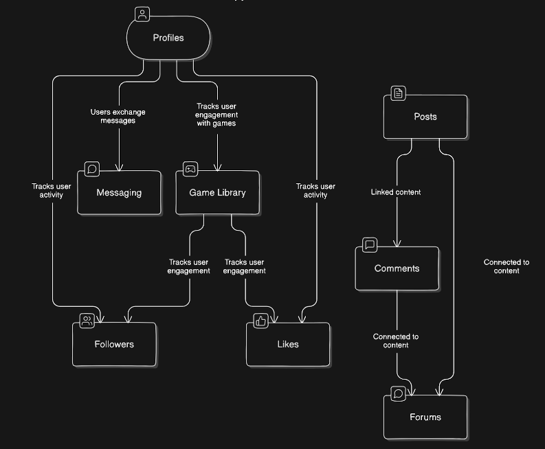
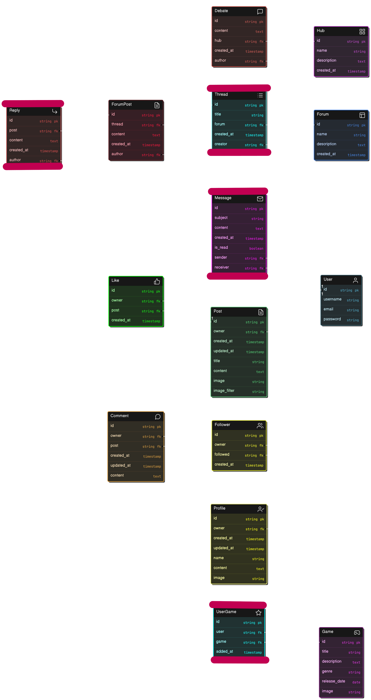

 
# [PIXELSTATION API](https://pixelstationproject5-api-1a9dadf46f0b.herokuapp.com)

This project is built with :

  

[](https://github.com/solracnauj92/pixelstation-api/commits/main)
[](https://github.com/solracnauj92/pixelstation-api/commits/main)


Welcome to Pixelstation API, a backend service for [Pixelstation](https://pixelstationproject5-api-1a9dadf46f0b.herokuapp.com).

# Buisness Model 
## Aim of the Website

Pixiel Station is a vibrant community platform designed for gamers, particularly those passionate about retro games, as well as those curious to explore this unique genre or stay informed about the latest releases. The site offers a rich set of features, including interactive posts, community-driven forums, debate hubs, a monthly themed forum, and a game library, making it a go-to spot for gaming enthusiasts.


## Key Findings from User Research

At the beginning of the Pixel Station project, conducting thorough research was essential, even though this project mainly focuses on backend development. Understanding the target audience and the types of users I aim to attract helped shape the overall feel of the website, ensuring that the correct Django apps are implemented to meet user needs.

### Target Audience

 

Pixel Station caters to a diverse group of gaming enthusiasts:

1. **Retro Gamers (30-50):**
   - Nostalgic for classics like Super Mario Bros.
   - Enthusiastic about discussing gaming evolution.

2. **Content Creators (20-35):**
   - Streamers and YouTubers focusing on retro gaming.
   - Seeking a collaborative community.

3. **Casual Gamers (18-30):**
   - Curious about the origins of gaming.
   - Open to discovering vintage titles.

4. **Parent-Educators (30-50):**
   - Parents introducing kids to childhood games.
   - Educators incorporating retro games into teaching.

5. **Generation Alpha (5-15):**
   - Kids and teens curious about gaming history.
   - Introduced to classic games by family.

6. **Collectors and Historians (All Ages):**
   - Collectors of retro gaming items.
   - Engaging in discussions about gaming eras.

### User Personas

1. **As a Classic Gamer:**
   - I want to browse and join discussions about my favorite classic games to connect with like-minded enthusiasts.

2. **As a Retro Streamer:**
   - I want to share my retro gaming experiences, collaborate with fellow creators, and grow my audience within the Pixel Station community.

3. **As a Casual Explorer:**
   - I want to discover and learn about vintage games, understanding their impact on the gaming industry.

4. **As a Gaming Parent:**
   - I want to find recommendations for classic games suitable for my child's age and interests, fostering a shared gaming experience.

5. **As a Teacher:**
   - I want to access resources that help integrate retro gaming into my teaching methods, making learning more engaging for my students.

6. **As a Generation Alpha Gamer:**
   - I want to explore the history of gaming, play classic games, and connect with other young gamers who share similar interests.

7. **As a Retro Collector:**
   - I want to showcase my collection, discuss rare finds, and connect with other collectors to exchange tips and experiences.

8. **As a Historian:**
   - I want to contribute to discussions about the historical significance of different gaming eras and share my knowledge with the community.

### Testimonials generated 

1. **Johnny - Retro Gamer (Age: 38):**
   > "Pixel Station has reignited my love for classic games! Connecting with fellow enthusiasts in the community has been a blast. The discussions about gaming evolution take me on a trip down memory lane. This platform truly captures the essence of retro gaming."

2. **Sam- Casual Explorer (Age: 25):**
   > "Being a casual gamer, I was curious about vintage titles, and Pixel Station has been the perfect guide! I've discovered hidden gems and learned so much about the origins of gaming. The community is welcoming, making my exploration of retro games even more enjoyable."

3. **Amy - Retro Streamer (Age: 32):**
   > "Pixel Station is a haven for content creators like me! Sharing my retro gaming experiences with a collaborative community has been fantastic. The support and engagement from viewers within the Pixel Station community have significantly boosted my channel. It's more than just a platform; it's a retro gaming family!"


# Django Backend API Overview


This backend API, built with **Django** and **Django REST Framework**, powers the core functionality of Pixiel Station. It provides robust data management and secure endpoints for user interaction, allowing the frontend to deliver a seamless and engaging experience. Key features managed by the backend include:

- **User Management**: Secure registration, authentication, and profile management, enabling users to like, follow, and connect with each other.
- **Forum & Comment Management**: Dynamic forum capabilities, including a "Monthly Quest" forum that sparks new discussions each month.
- **Debate Hub**: A space where users can express their views on a range of gaming-related topics.
- **Game Library**: A catalog of games where users can add, explore, and interact with entries.
- **Newsletter Integration**: Tools for community updates and keeping users connected.

### What is Django and Why Use It?

**Django** is a high-level, open-source web framework in Python designed to encourage rapid development and clean, pragmatic design. Developed to make the process of creating complex, database-driven websites simpler and more secure, Django provides a variety of tools out of the box, allowing developers to focus on building their application's unique features rather than reinventing the wheel. 

For Pixiel Station, Django was chosen because:

1. **Efficiency**: Django’s structure promotes reusable and modular code, which supports fast development cycles and makes maintenance easier. 
2. **Security**: Django provides a robust security layer, helping developers avoid common vulnerabilities such as SQL injection, cross-site scripting, and cross-site request forgery.
3. **Scalability**: The framework’s ability to handle heavy traffic and large databases makes it ideal for community-focused applications like Pixiel Station.
4. **RESTful API Support**: Paired with Django REST Framework, Django makes it easy to create a powerful API that can handle complex user interactions and data management.

### Django Version

This project uses **Django 3.2.23**, a stable version compatible with Django REST Framework, recommended for projects hosted on educational and production environments. This version is also the one suggested in the Code Institute lessons, ensuring that the project stays aligned with best practices for beginner and intermediate developers.

## Django Apps

### Key Installed Django Apps

#### Django Core Apps
- **django.contrib.admin**: Provides an admin interface for managing the application's data models.
- **django.contrib.auth**: Manages user authentication, permissions, and authorization.
- **django.contrib.contenttypes**: Handles generic relations and provides the ability to track models in the application.
- **django.contrib.sessions**: Manages session data to store user-specific information across requests.
- **django.contrib.messages**: Enables temporary message storage to be displayed to users.
  
#### Cloudinary
- **cloudinary_storage** & **cloudinary**: Manage image storage, uploading, and media handling via Cloudinary's cloud service.

#### REST Framework & Extensions
- **rest_framework**: A powerful toolkit for building Web APIs. Provides tools for serializing data and handling HTTP requests in a RESTful manner.
- **django_filters**: Provides filtering capabilities for API views, allowing dynamic querying based on parameters.
- **dj_rest_auth**: Adds authentication and user registration functionality to the backend, including login, registration, and password reset functionality.

#### Allauth
- **allauth**: A highly flexible authentication app that handles user registration, social account integration, and email verification.
- **allauth.account**: Manages user authentication, registration, password management, and account-related views.
- **allauth.socialaccount**: Enables social media logins via platforms like Facebook, Google, etc.
  
#### Corsheaders
- **corsheaders**: Configures Cross-Origin Resource Sharing (CORS) to enable safe cross-origin requests between the frontend and backend.


## Original Custom App Structure and Future Enhancements

This backend API focuses on achieving a functional foundation across apps, with simplified implementations for certain features due to project constraints. Each app contributes to Pixiel Station's core experience, with several areas identified for future enhancement as I continue to develop my skills. 

> **Note**: Originally, the project scope included the Game Library, Forum, Post, Like, Comment, and User Profile apps. Additional features, such as the Debate Hub and Newsletter, were incorporated as extra functionality, expanding the site's interactive capabilities. 

Here's the original flowchart:

 

> **Note**: Originally, the project scope included the Game Library, Forum, Post, Like, Comment, and User Profile apps. Additional features, such as the Debate Hub and Newsletter, were incorporated as extra functionality, expanding the site's interactive capabilities. 

Current relationship entity chart:
> **Note**: Entity relationships with red lines at the top and bottom of the box indicate features that were originally implemented but are now planned as future features for the website.

 

#### 1. Post, Like, Follow, and User Profile Apps
These apps provide Pixiel Station's core social interaction features, allowing users to create posts, like content, follow other users, and manage their profiles. Built based on the Code Institute’s walkthrough project, they include basic social functionalities essential for user engagement and connection.

#### 2. Game Library App
The Game Library app was designed to offer a catalog where users could add games and manage personal collections. Currently, users can add games and view the game library, but the feature to create personal collections was not completed within the project timeline. The app provides a functional, community-accessible library, with future updates planned to enhance personalisation.

#### 3. Forum App
Initially, the Forum app was planned to have a standard thread-and-reply structure for in-depth discussions. Due to time constraints and a learning curve with Django and React, the forum design was simplified to allow users to create a forum topic with a title and description, appearing as a direct-response format on the frontend. While functional, this diverges from the original vision, with plans for a full thread structure in future updates.

#### 4. Debate Hub App
Similar to the Forum app, the Debate Hub was envisioned to support nested discussions within each debate topic. The current implementation allows users to view a list of debate topics and participate directly. Although the nested reply structure was postponed, users can still engage in discussions within each hub topic. Future updates will introduce the intended thread-and-reply model.

### 5. Newsletter App
The Newsletter app allows users to subscribe to community updates. This app was implemented fully as intended, enabling community connection without requiring major adjustments.

### 6. Messaging App (Not Functional)
The Messaging app posed significant challenges, particularly in endpoint connections, and remained non-functional at the project's close. Despite dedicated troubleshooting efforts, limited support options made resolving these issues difficult. In the future, I plan to reattempt this feature, potentially by following additional tutorials or seeking further guidance to implement a reliable messaging service.


## App Models 

### Comment App


The **Comment** app allows users to comment on posts.

#### Functionality Breakdown:
- **Models (models.py)**: Defines comment structure.
- **Serializers (serializers.py)**: Transforms comment data between Python objects and JSON.
- **Views (views.py)**: Handles requests for comments, interacting with models and serializers.
- **URLs (urls.py)**: Routes requests to views.
- **Admin (admin.py)**: Manages comments in the Django admin interface.
- **Migrations (migrations/)**: Tracks database schema changes.
- **Tests (tests.py)**: Ensures functionality works as expected.

#### Comment Model:
- **Fields**: `owner`, `post`, `content`, `created_at`, `updated_at`.
- **Ordering**: Comments are ordered by creation date (newest first).

#### Serializers:
- **CommentSerializer**: Handles serialization and deserialization of comments.
- **CommentDetailSerializer**: Extends CommentSerializer for detailed views.

---

### Follower App

The **Follower** app allows users to follow/unfollow each other.

#### Functionality Breakdown:
- **Models (models.py)**: Defines follower structure.
- **Serializers (serializers.py)**: Transforms follower data for API responses.
- **Views (views.py)**: Handles follower-related requests.
- **URLs (urls.py)**: Routes requests.
- **Admin (admin.py)**: Manages followers in the admin interface.
- **Migrations (migrations/)**: Tracks schema changes.
- **Tests (tests.py)**: Ensures expected functionality.

#### Follower Model:
- **Fields**: `owner`, `followed`, `created_at`.
- **Ordering**: Newest followers first.
- **Unique Constraint**: Prevents duplicate follow relationships.

#### Serializers:
- **FollowerSerializer**: Handles serialization of follower data.

---

### Forum App

The **Forum** app allows users to engage in discussions by creating forums, threads, and posts, with the ability to reply to forum posts.

#### Functionality Breakdown:
- **Models (models.py)**: Defines forum, thread, post, and reply structures.
- **Serializers (serializers.py)**: Transforms forum-related data.
- **Views (views.py)**: Handles forum, thread, post, and reply requests.
- **URLs (urls.py)**: Routes requests.
- **Admin (admin.py)**: Manages forums, threads, and posts in the admin interface.
- **Migrations (migrations/)**: Tracks schema changes.
- **Tests (tests.py)**: Ensures expected functionality.

#### Models:
- **Forum**: Fields include `name`, `description`, `created_at`.
- **Thread**: Fields include `title`, `forum`, `creator`, `created_at`.
- **ForumPost**: Fields include `content`, `thread`, `author`, `created_at`.
- **Reply**: Fields include `content`, `post`, `author`, `created_at`.

#### Serializers:
- **ForumSerializer**: Serializes forum data.
- **ThreadSerializer**: Serializes thread data.
- **ForumPostSerializer**: Serializes forum post data.
- **ReplySerializer**: Serializes reply data.

#### Views:
- **ForumList**: Lists all forums and allows creation of new forums.
- **ForumDetail**: Retrieves, updates, or deletes a specific forum.
- **ThreadListCreate**: Lists threads in a forum or allows creating new threads.
- **ThreadDetail**: Retrieves, updates, or deletes a specific thread.
- **ReplyListCreate**: Lists replies to a specific thread or allows creating new replies.

---

### Game Library App


The **Game Library** app allows users to manage their game collections.

#### Functionality Breakdown:
- **Models (models.py)**: Defines game and collection structures.
- **Serializers (serializers.py)**: Transforms game data.
- **Views (views.py)**: Handles game-related requests.
- **URLs (urls.py)**: Routes requests.
- **Admin (admin.py)**: Manages games in the admin interface.
- **Migrations (migrations/)**: Tracks schema changes.
- **Tests (tests.py)**: Ensures expected functionality.

#### Models:
- **Game**: Fields include `title`, `description`, `genre`, `release_date`, `image`.
- **UserGame**: Fields include `user`, `game`, `added_at`.

#### Serializers:
- **GameSerializer**: Serializes game data.
- **UserGameSerializer**: Serializes user game collection data with additional fields like `game_title`.


---

### Likes App

The **Likes** app allows users to express appreciation for posts.

#### Functionality Breakdown:
- **Models (models.py)**: Defines like structure.
- **Serializers (serializers.py)**: Transforms like data.
- **Views (views.py)**: Handles like-related requests.
- **URLs (urls.py)**: Routes requests.
- **Admin (admin.py)**: Manages likes in the admin interface.
- **Migrations (migrations/)**: Tracks schema changes.
- **Tests (tests.py)**: Ensures expected functionality.

#### Like Model:
- **Fields**: `owner`, `post`, `created_at`.

#### Serializers:
- **LikeSerializer**: Handles like data serialization.

---

### Messaging App

The **Messaging** app allows users to send and receive messages.

#### Functionality Breakdown:
- **Models (models.py)**: Defines the message structure.
- **Serializers (serializers.py)**: Transforms message data.
- **Views (views.py)**: Handles message-related requests.
- **URLs (urls.py)**: Routes requests.
- **Admin (admin.py)**: Manages messages in the admin interface.
- **Migrations (migrations/)**: Tracks schema changes.
- **Tests (tests.py)**: Ensures expected functionality.

#### Models:
- **Message**: Fields include `sender`, `receiver`, `subject`, `content`, `created_at`, `is_read`.

#### Serializers:
- **MessageSerializer**: Serializes message data, including `sender`, `receiver`, `subject`, `content`, and `created_at`.

#### Views:
- **MessageViewSet**: Handles message listing, filtering by receiver, and message creation for authenticated users.


---

### Post App

The **Post** app allows users to create and manage posts.

#### Functionality Breakdown:
- **Models (models.py)**: Defines post structure.
- **Serializers (serializers.py)**: Transforms post data.
- **Views (views.py)**: Handles post-related requests.
- **URLs (urls.py)**: Routes requests.
- **Admin (admin.py)**: Manages posts in the admin interface.
- **Migrations (migrations/)**: Tracks schema changes.
- **Tests (tests.py)**: Ensures expected functionality.

#### Post Model:
- **Fields**: `owner`, `created_at`, `updated_at`, `title`, `content`, `comments`, `likes`, `image`, `image_filter`.

#### Serializers:
- **PostSerializer**: Handles post data serialization.

---


---

### User Profile App

The **User Profile** app allows users to create and manage profiles.

#### Functionality Breakdown:
- **Models (models.py)**: Defines profile structure.
- **Serializers (serializers.py)**: Transforms profile data.
- **Views (views.py)**: Handles profile-related requests.
- **URLs (urls.py)**: Routes requests.
- **Admin (admin.py)**: Manages profiles in the admin interface.
- **Migrations (migrations/)**: Tracks schema changes.
- **Tests (tests.py)**: Ensures expected functionality.

#### Profile Model:
- **Fields**: `owner`, `created_at`, `updated_at`, `name`, `content`, `image`.

#### Serializers:
- **ProfileSerializer**: Handles profile data serialization.

#### Views:
- **ProfileList View**: Lists user profiles.
- **ProfileDetail View**: Retrieves and updates specific profiles.

---


---

### Newsletter Subscription App

The **Newsletter Subscription** app allows users to subscribe to community updates.

#### Functionality Breakdown:
- **Models (models.py)**: Defines subscription structure.
- **Serializers (serializers.py)**: Transforms subscription data.
- **Views (views.py)**: Handles subscription-related requests.
- **URLs (urls.py)**: Routes requests.
- **Admin (admin.py)**: Manages subscriptions in the admin interface.
- **Migrations (migrations/)**: Tracks schema changes.
- **Tests (tests.py)**: Ensures expected functionality.

#### Models:
- **NewsletterSubscription**: Fields include `name`, `email`, `created_at`.

#### Serializers:
- **NewsletterSubscriptionSerializer**: Handles subscription data serialization.

#### Views:
- **NewsletterSubscriptionView**: Allows users to create a new subscription.
- **NewsletterSubscriptionListView**: Lists all subscriptions with filtering options.

#### Custom Logic:
- **Subscription Validation**: Prevents duplicate email subscriptions.


---


---

### Debate Hub

The **Debate Hub** app allows users to create hubs for debates and participate in discussions within them.

#### Functionality Breakdown:
- **Models (models.py)**: Defines the hub and debate structures.
- **Serializers (serializers.py)**: Transforms hub and debate data.
- **Views (views.py)**: Handles requests related to hubs and debates.
- **URLs (urls.py)**: Routes requests for hubs and debates.
- **Admin (admin.py)**: Manages hubs and debates in the admin interface.
- **Migrations (migrations/)**: Tracks schema changes.
- **Tests (tests.py)**: Ensures expected functionality.

#### Hub Model:
- **Fields**: `name`, `description`, `created_at`.

#### Debate Model:
- **Fields**: `content`, `hub`, `author`, `created_at`.

#### Serializers:
- **HubSerializer**: Serializes data for hubs.
- **DebateSerializer**: Serializes data for debates.

#### Views:
- **HubList View**: Lists and creates hubs.
- **HubDetail View**: Retrieves a specific hub.
- **HubDebateList View**: Lists and creates debates within a hub.
- **DebateDetail View**: Retrieves, updates, or deletes a specific debate.

-----

# Key Features Implemented / User Stories

### 1. User Profile Management
Manage your profile to update personal information and preferences.

- **User Story**: As a user, I want to create and edit my profile so that others can know more about me.
  - **Description**: Users should be able to enter and update personal information such as bio, location, and interests.
  - **Acceptance Criteria**: Users can fill out and update profile information, with changes reflected on their profile page.

- **User Story**: As a user, I want to upload a profile picture so that my profile is visually recognizable.
  - **Description**: Users should have the option to upload, change, or remove a profile picture.
  - **Acceptance Criteria**: Users can upload a profile picture, see it displayed on their profile, and change or delete it as needed.

---

### 2. Creating and Managing Posts
Create and manage posts to share content with others.

- **User Story**: As a user, I want to create a new post so that I can share content with my followers.
  - **Description**: Users should be able to create posts with text, images, or other media.
  - **Acceptance Criteria**: Users can create a post, which is then displayed in their feed and visible to their followers.

- **User Story**: As a user, I want to edit or delete my posts so that I can manage the content I share.
  - **Description**: Users should have the ability to modify or remove their own posts.
  - **Acceptance Criteria**: Users can edit the content of a post or delete it entirely, with changes reflected in real-time.

---

### 3. Like and Unlike Functionality
Like or unlike posts to express appreciation for content.

- **User Story**: As a user, I want to like a post to express my appreciation for the content.
  - **Description**: Users should be able to click a like button on posts.
  - **Acceptance Criteria**: Users can click a like button, increasing the like count on the post.

- **User Story**: As a user, I want to unlike a post I previously liked to change my reaction.
  - **Description**: Users should be able to remove their like from a post.
  - **Acceptance Criteria**: Users can click an unlike button, decreasing the like count on the post.

---

### 4. Commenting on Posts
Comment on posts to engage in discussions with others.

- **User Story**: As a user, I want to comment on a post to engage in discussions.
  - **Description**: Users should be able to leave comments on posts to start or join conversations.
  - **Acceptance Criteria**: Users can enter and submit a comment, which appears under the post.

- **User Story**: As a user, I want to edit or delete my comments to manage my interactions.
  - **Description**: Users should be able to modify or remove their comments.
  - **Acceptance Criteria**: Users can edit the content of a comment or delete it, with changes reflected in real-time.

---

### 5. User Registration and Sign In
Register and sign in to access the platform and its features.

- **User Story**: As a user, I want to create an account so that I can use the platform.
  - **Description**: Users should be able to sign up by providing necessary details like username, email, and password.
  - **Acceptance Criteria**: Users can fill out a registration form, submit it, and receive a confirmation email to activate the account.

- **User Story**: As a user, I want to sign in to my account to access my profile and posts.
  - **Description**: Users should be able to log in using their registered email and password.
  - **Acceptance Criteria**: Users can enter credentials on a login form, submit them, and access their account if the credentials are correct.

---

### 6. Site Navigation
Enjoy intuitive navigation to easily find content and features.

- **User Story**: As a user, I can view a navbar from every page to navigate easily between pages.
  - **Description**: A consistent navigation bar is available on all pages, providing links to essential parts of the site (e.g., Home, Profile, Notifications, Messages).
  - **Acceptance Criteria**: Navbar appears on every page and contains links that function correctly.

---

### 7. Following and Unfollowing Users
Manage your social connections effectively.

- **User Story**: As a user, I want to follow other users to see their posts in my feed.
  - **Description**: Users should be able to follow other users to receive their updates.
  - **Acceptance Criteria**: Users can click a follow button, and the followed user’s posts appear in their feed.

- **User Story**: As a user, I want to unfollow users I am no longer interested in so that my feed stays relevant.
  - **Description**: Users should be able to unfollow users they are no longer interested in.
  - **Acceptance Criteria**: Users can click an unfollow button, and the unfollowed user’s posts no longer appear in their feed.

---

### 8. Followers and Following Lists
Display the users' social connections.

- **User Story**: As a user, I want to see a list of my followers to know who is following me.
  - **Description**: Users should be able to view a list of people who follow them.
  - **Acceptance Criteria**: Users can access a followers list from their profile.

- **User Story**: As a user, I want to see a list of users I am following to manage my connections.
  - **Description**: Users should be able to view a list of people they are following.
  - **Acceptance Criteria**: Users can access a following list from their profile.

---

### 9. Messaging Functionality
Communicate privately with other users.

- **User Story**: As a user, I want to send messages to other users to communicate privately.
  - **Description**: Users should be able to send direct messages to other users.
  - **Acceptance Criteria**: Users can compose and send a message, which is received by the recipient.

- **User Story**: As a user, I want to receive messages from other users to have conversations.
  - **Description**: Users should be able to receive and read direct messages from other users.
  - **Acceptance Criteria**: Users can receive notifications for new messages and read them in a dedicated inbox.

---

### 10. User Notifications
Keep users informed about interactions.

- **User Story**: As a user, I want to receive notifications for likes, comments, follows, and messages to stay informed about interactions with my content.
  - **Description**: Users should receive real-time notifications for various activities related to their account.
  - **Acceptance Criteria**: Users receive notifications for likes, comments, follows, and messages, either through the app or via email.

---

### 11. Search Functionality
Find users and content easily.

- **User Story**: As a user, I want to search for other users to connect with them.
  - **Description**: Users should be able to search for other users by name or username.
  - **Acceptance Criteria**: Users can enter a query in a search bar and see a list of matching users.

- **User Story**: As a user, I want to search for posts by keywords to find relevant content.
  - **Description**: Users should be able to search for posts using keywords.
  - **Acceptance Criteria**: Users can enter keywords in a search bar and see a list of matching posts.

---

### 12. Feed and Timeline
Interact with your and others’ content.

- **User Story**: As a user, I want to see a feed of posts from users I follow to stay updated with their latest content.
  - **Description**: Users should have a feed that displays posts from the users they follow.
  - **Acceptance Criteria**: Users can view a feed with the latest posts from followed users.

- **User Story**: As a user, I want to see my own posts in my timeline to review my shared content.
  - **Description**: Users should be able to view a chronological list of their own posts.
  - **Acceptance Criteria**: Users can access a personal timeline that shows all their posts.

---

### 13. Privacy Settings
Control your privacy on the platform.

- **User Story**: As a user, I want to set my profile to private so that only approved followers can see my posts.
  - **Description**: Users should have the option to make their profile private.
  - **Acceptance Criteria**: Users can toggle a privacy setting that restricts profile visibility to approved followers.

- **User Story**: As a user, I want to manage my notification preferences to receive alerts that are important to me.
  - **Description**: Users should be able to customize which notifications they receive and how.
  - **Acceptance Criteria**: Users can access and adjust notification settings to their preference.

-----------------------

### URL Configuration

The `urlpatterns` list routes URLs to views.

#### Comments App:
- **POST** `/comments/` - List all comments.
- **GET** `/comments/<int:pk>/` - Retrieve, update, or delete a specific comment.

#### Debate Hub App:
- **GET** `/hubs/` - List all hubs.
- **GET** `/hubs/<int:id>/` - Retrieve details of a specific hub.
- **GET** `/hubs/<int:id>/debates/` - List all debates in a specific hub.
- **GET** `/hubs/<int:hub_id>/debates/<int:pk>/` - Retrieve, update, or delete a specific debate.

#### Follower App:
- **POST** `/followers/` - List all followers.
- **GET** `/followers/<int:pk>/` - Retrieve, update, or delete a specific follower.

#### Forum App:
- **GET** `/forums/` - List all forums.
- **GET** `/forums/<int:pk>/` - Retrieve, update, or delete a specific forum.
- **POST** `/forums/<int:forum_id>/threads/` - List or create threads in a specific forum.
- **GET** `/threads/<int:pk>/` - Retrieve, update, or delete a specific thread.
- **POST** `/threads/<int:thread_id>/replies/` - List or create replies for a specific thread.

#### Game Library App:
- **GET** `/game-library/` - Display game library homepage.
- **GET** `/game-library/games/` - List all games.
- **GET** `/game-library/games/<int:pk>/` - Retrieve details of a specific game.
- **GET** `/game-library/user-games/` - List games associated with the logged-in user.

#### Likes App:
- **GET** `/likes/` - List all likes.
- **GET** `/likes/<int:pk>/` - Retrieve, update, or delete a specific like.

#### Messaging App:
- **GET** `/messages/<int:user_id>/` - List all messages for a user.
- **POST** `/messages/` - Create a new message.

#### Posts App:
- **GET** `/posts/` - List all posts.
- **GET** `/posts/<int:pk>/` - Retrieve, update, or delete a specific post.

#### Profiles App:
- **GET** `/profiles/` - List all profiles.
- **GET** `/profiles/<int:pk>/` - Retrieve, update, or delete a specific profile.

## Project Challenges and Issues with Endpoints

During the development of this project, I encountered several challenges, particularly with matching endpoints between the backend (Django) and the frontend (React). A major issue stemmed from typographical errors, similar naming conventions, and my limited experience working with both Django and React together. These issues led to difficulties in fetching data correctly, causing delays and additional debugging time.

Due to these problems, I had to carefully review and ensure that all endpoints worked properly and didn't cause issues in the frontend. However, despite these efforts, not all endpoints are fully functional, as some are intended for future implementation. Unfortunately, due to time constraints, I was unable to properly integrate and test these endpoints before the deadline.

Moving forward, I plan to revisit these issues, implement the missing features, and ensure that all endpoints are fully functional to provide a seamless experience between the frontend and backend.


## Technologies Used

The following technologies were used throughout the development of this project:

- **PostgreSQL** - A powerful, open-source relational database management system used for data storage.
- **Django** - The web framework used to build the backend API.
- **Python** - The programming language used for the backend development.
- **Heroku** - The cloud platform used for deploying the project.
- **Cloudinary** - Used for managing and delivering media files (images, videos).

## JWT Authentication Setup

In this project, JSON Web Tokens (JWT) authentication is integrated using the Django Rest Auth and Simple JWT libraries. The process involved installing the required packages, configuring settings for JWT authentication, and setting up separate authentication methods for development (using session-based authentication) and production (using token-based authentication). The user registration, login, and profile details retrieval processes are secured with JWT, and the necessary endpoints for user authentication and token management are configured. Additionally, the user's profile information (profile ID and image) is included in the user details response.

-----------------------

## Cloudinary Setup

Cloudinary is a powerful cloud-based media management platform that streamlines the process of storing, managing, and delivering images and videos. It offers seamless integration with web applications, enabling efficient media handling through features like image uploads, transformations, and optimized delivery.

In this project, I registered for Cloudinary and configured the Django application to utilize its services for image hosting. This integration enhances media management by automating image uploads, storage, and delivery, improving overall application performance and scalability.


### Setup Steps according to Code Insitute Walkthrough:

1. **Sign Up for Cloudinary:**
   - Go to [Cloudinary](https://cloudinary.com) and sign up for a free account.
   - After registering, validate your account via the confirmation email.
   - In the `Media Library`, you can upload sample images or drag and drop images from your machine.

2. **Get API Credentials:**
   - From the `Dashboard`, go to the account details section and find the **API Environment Variable**. This contains the API credentials you'll use to connect Django to Cloudinary.

3. **Create a Django Project:**
   - Initialize a new Django project using `django-admin startproject drf_api` or use an existing one.
   - Install the necessary libraries: `django-cloudinary-storage` for Cloudinary integration and `Pillow` for image processing:
     ```bash
     pip install django-cloudinary-storage Pillow
     ```

4. **Configure Django Settings:**
   - In `settings.py`, add the following apps to `INSTALLED_APPS` in the specified order:
     ```python
     INSTALLED_APPS = [
         'django.contrib.staticfiles',
         'cloudinary_storage',
         'cloudinary',
         ...
     ]
     ```
   - Set up the **Cloudinary Environment Variable**:
     Create a file named `env.py` in your project’s root directory and include your Cloudinary API credentials:
     ```python
     import os
     os.environ['CLOUDINARY_URL'] = '<your_cloudinary_url>'
     ```

5. **Set up Media Configuration:**
   - In `settings.py`, configure Cloudinary by setting:
     ```python
     CLOUDINARY_STORAGE = {
         'CLOUDINARY_URL': os.getenv('CLOUDINARY_URL')
     }

     MEDIA_URL = '/media/'
     DEFAULT_FILE_STORAGE = 'cloudinary_storage.storage.MediaCloudinaryStorage'
     ```
   
6. **Test the Configuration:**
   - With these settings in place, Django will automatically handle image uploads using Cloudinary.
   - Uploaded images will be served from Cloudinary’s CDN.


# PostgreSQL Database Setup


PostgreSQL is a powerful, open-source relational database management system, chosen for this project due to its compatibility with Django, data integrity features, and scalability. PostgreSQL ensures efficient data handling both during development and in production on Heroku, which offers seamless integration with PostgreSQL through its add-ons.

### Why PostgreSQL?
- **Data Integrity and Security**: Supports transactional integrity, protecting data from corruption and ensuring consistent state.
- **Compatibility with Django**: Django’s ORM (Object-Relational Mapping) natively supports PostgreSQL, making querying and migrations simpler.
- **Scalability**: PostgreSQL is well-suited for large datasets and high-traffic applications, which is ideal for this project.
- **Heroku Integration**: Heroku provides the Heroku Postgres add-on, which allows PostgreSQL databases to be easily set up and managed in production.

#### Setting Up PostgreSQL

#### 1. Local Development Setup

To set up PostgreSQL for local development:

1. **Install PostgreSQL**:
   - Download and install PostgreSQL from [PostgreSQL Downloads](https://www.postgresql.org/download/).
   - Create a new PostgreSQL database and user for your project.

2. **Configure Django to Use PostgreSQL**:
   - In your `settings.py`, update the `DATABASES` configuration to use PostgreSQL as follows:

     ```python
     DATABASES = {
         'default': {
             'ENGINE': 'django.db.backends.postgresql',
             'NAME': 'your_database_name',
             'USER': 'your_username',
             'PASSWORD': 'your_password',
             'HOST': 'localhost',
             'PORT': '5432',
         }
     }
     ```

3. **Apply Migrations**:
   - Run the following commands to apply migrations to your PostgreSQL database:
     ```bash
     python manage.py makemigrations
     python manage.py migrate
     ```

#### 2. Production Database Setup on Heroku

To configure PostgreSQL for production on Heroku:

1. **Add the Heroku Postgres Add-On**:
   - In your Heroku dashboard, navigate to your app, go to the **Resources** tab, and search for "Heroku Postgres" to add it.
   - This will automatically set the `DATABASE_URL` environment variable in your Heroku config with the PostgreSQL database connection information.

2. **Update Django Settings for Production**:
   - Modify `settings.py` to retrieve the database configuration from the `DATABASE_URL` environment variable.
   - This can be done using the `dj_database_url` package, which parses the `DATABASE_URL` and configures Django accordingly.

     ```python
     import dj_database_url

     DATABASES = {
         'default': dj_database_url.config(default='postgres://localhost')
     }
     ```

## Troubleshooting: Database Forgetting Data Issue in the Front-End

### The Problem
While working on the project, I encountered an issue where the front-end would register data (like user profiles) successfully, but after some time, the data would disappear or the website would "forget" about it. Despite entering data and seeing successful registration messages, the information would not persist, leading to inconsistent behavior and confusion. 

This issue persisted for about **two weeks**, during which I was convinced that there was something wrong with my code or database configuration. I spent a lot of time debugging, trying different approaches, and adjusting the code, but the problem remained.

### Resolution with Code Institute Support
After several failed attempts to fix the issue, I reached out to the Code Institute tutor for help. On the **4th attempt**, after explaining the situation, the tutor suggested that the root of the issue was related to the **database link** being used on Heroku. This database link was not properly set up to persist the data, causing the data to be lost periodically.

The tutor recommended creating a **new PostgreSQL database link** on Heroku and reconfiguring the project to connect to this new link. This step helped resolve the issue by ensuring the database was correctly set up to persist data.

I'm extremely thankful for the **guidance from the Code Institute tutor**. If it weren't for their advice on switching to a new database link, I would have continued to struggle for much longer. This experience highlighted the importance of checking external services and their configurations, and not solely focusing on the code itself when troubleshooting issues.

From this point forward, everything began to work smoothly, and the application was able to retain user data across sessions.


# How to create a New App on Heroku

To deploy your project to Heroku, follow these steps to create a new app:

1. **Log into Heroku** and go to the [Heroku Dashboard](https://dashboard.heroku.com/).
2. Click on **“New”** (button with new and an expansion icon).
3. Select **“Create new app”** from the dropdown menu.
4. **Give your app a unique name** and select the region closest to you. Once done, click **“Create app”** to confirm.

5. Once the app is created, open the **Settings tab** for the app.

6. In the **Settings** tab, **Add a Config Var**:
   - **Key**: `DATABASE_URL`
   - **Value**: Copy your **PostgreSQL URL** from the email you received from Code Institute (do not add quotation marks).

## Deployment to Heroku

Here's the way I have deployed the project, if you want to learn the steps, follow these steps:

1. **Install Required Packages**:
   - Install `gunicorn` and `django-cors-headers`:
     ```bash
     pip3 install gunicorn django-cors-headers
     ```

2. **Update `requirements.txt`**:
   - Ensure all dependencies are listed:
     ```bash
     pip freeze --local > requirements.txt
     ```

3. **Create a `Procfile`**:
   - In the root directory, create a file named `Procfile` (no file extension).
   - Add the following lines:
     ```bash
     release: python manage.py makemigrations && python manage.py migrate
     web: gunicorn drf_api.wsgi
     ```

4. **Update `ALLOWED_HOSTS` in `settings.py`**:
   - Include your Heroku app’s URL:
     ```python
     ALLOWED_HOSTS = ['localhost', '<your_app_name>.herokuapp.com']
     ```

5. **Add `corsheaders` to `INSTALLED_APPS`**:
   - Update the `INSTALLED_APPS` list in `settings.py`:
     ```python
     INSTALLED_APPS = [
         'corsheaders',
         ...
     ]
     ```

6. **Add CORS Middleware**:
   - Add `corsheaders.middleware.CorsMiddleware` to the top of the `MIDDLEWARE` list in `settings.py`:
     ```python
     MIDDLEWARE = [
         'corsheaders.middleware.CorsMiddleware',
         ...
     ]
     ```

7. **Configure CORS Allowed Origins**:
   - Allow network requests from specific origins, including `CLIENT_ORIGIN` (if in production):
     ```python
     if 'CLIENT_ORIGIN' in os.environ:
         CORS_ALLOWED_ORIGINS = [os.environ.get('CLIENT_ORIGIN')]
     else:
         CORS_ALLOWED_ORIGIN_REGEXES = [r"^https://.*\.gitpod\.io$"]
     ```

8. **Enable Cookies for Cross-Origin Requests**:
   - Allow cookies to be sent with cross-origin requests:
     ```python
     CORS_ALLOW_CREDENTIALS = True
     ```

9. **Configure JWT Authentication for Cross-Domain Usage**:
   - Set `JWT_AUTH_SAMESITE` to `None` for different front-end and back-end domains:
     ```python
     JWT_AUTH_SAMESITE = 'None'
     ```

10. **Use Environment Variable for `SECRET_KEY`**:
    - Avoid exposing `SECRET_KEY` by using an environment variable:
      ```python
      SECRET_KEY = os.getenv('SECRET_KEY')
      ```

11. **Set `SECRET_KEY` in `env.py`**:
    - Set a new random value for `SECRET_KEY` in `env.py`:
      ```python
      os.environ.setdefault("SECRET_KEY", "CreateANEWRandomValueHere")
      ```

12. **Set `DEBUG` for Development**:
    - Set `DEBUG` to `True` in development and `False` in production:
      ```python
      DEBUG = 'DEV' in os.environ
      ```

13. **Ensure `requirements.txt` is Up to Date**:
    - Run the following command to update `requirements.txt`:
      ```bash
      pip freeze --local > requirements.txt
      ```

14. **Add, Commit, and Push Changes to GitHub**:
    - After making all changes, commit and push your code to GitHub to ensure it's saved.

   
## Heroku Deployment

To deploy the project to Heroku, I have followed these steps:

### 1. **Set up Config Vars on Heroku**

   - Go to the **Settings** tab of your Heroku app.
   - Under the **Config Vars** section, add the following:
     - `SECRET_KEY`: Create a new secret key (do not use the one from `settings.py`).
     - `CLOUDINARY_URL`: Copy the Cloudinary URL from your `env.py` file (without quotation marks).

   Example:

   | Key            | Value                              |
   |----------------|------------------------------------|
   | `SECRET_KEY`   | `your-new-generated-secret-key`    |
   | `CLOUDINARY_URL` | `cloudinary://your-cloudinary-url` |

### 2. **Deploy the App**

   - Go to the **Deploy** tab in the Heroku dashboard.
   - In the **Deployment method** section, select **Connect to GitHub**.
   - Search for your repository and click **Connect**.
   - Optionally, enable **Automatic Deploys** to deploy automatically whenever you push to GitHub.
   - Since all your changes have already been pushed, use **Manual Deploy** to deploy immediately:
     - In the **Manual deploy** section, select the **Deploy Branch** button to trigger the build process.

   Heroku will now build and deploy your app. Once completed, you should see a successful build log.

### 3. **Launch the App**

   - After the deployment finishes, click the **Open app** button to open your deployed project.
   - Verify that your project is working by checking for the JSON welcome message on the home screen.

# Dependencies Documentation


This project uses the following Python packages. **Note**: I had to downgrade all packages to ensure compatibility with the frontend dependencies, particularly due to the need for matching versions across both back-end and front-end setups.

| Package                               | Version      | Description                                    |
|---------------------------------------|--------------|------------------------------------------------|
| asgiref                               | 3.8.1        | ASGI utilities for Django                      |
| cloudinary                            | 1.41.0       | Cloud-based image and video management         |
| dj-database-url                       | 0.5.0        | Utility to parse database URLs for Django      |
| dj-rest-auth                          | 2.1.9        | REST API endpoints for authentication          |
| Django                                | 3.2.23       | High-level web framework                       |
| django-allauth                        | 0.52.0       | Authentication and account management          |
| django-cloudinary-storage             | 0.3.0        | Storage backend for Cloudinary                 |
| django-cors-headers                   | 4.3.1        | CORS headers for responses                     |
| django-filter                         | 23.4         | Queryset filtering                             |
| djangorestframework                   | 3.14.0       | Toolkit for building APIs                      |
| djangorestframework-simplejwt         | 5.3.1        | JWT authentication                             |
| gunicorn                              | 23.0.0       | WSGI HTTP server for UNIX                      |
| oauthlib                              | 3.2.2        | OAuth request-signing logic                    |
| pillow                                | 10.4.0       | Image processing                               |
| psycopg2                              | 2.9.9        | PostgreSQL adapter                             |
| PyJWT                                 | 2.9.0        | JSON Web Token handling                        |
| python3-openid                        | 3.2.0        | OpenID authentication                          |
| pytz                                  | 2024.2       | Timezone calculations                          |
| requests-oauthlib                     | 2.0.0        | OAuth for requests                             |
| sqlparse                              | 0.5.1        | SQL parsing                                    |


The backend API uses older versions of dependencies, which were specifically chosen due to their stability and the fact that they have been well-tested in the project. These versions have been integrated into the project for a while and are known to work without introducing major issues, meaning they have a proven track record of reliability.

### Why Older Versions Are Used

- **Proven Stability**: The older versions of dependencies (e.g., Django 3.2.25, PostgreSQL, Cloudinary) have been extensively tested and are known to be stable with this project. This ensures the current functionality of the backend API remains consistent without any unexpected issues.

- **Documentation Availability**: With older versions, there's abundant documentation, tutorials, and community support. The libraries have been around for longer, making it easier to find solutions to any challenges that may arise.

- **Compatibility**: The older versions have been chosen to work well together, ensuring that all dependencies are compatible and that integration between different components of the project is seamless. Upgrading to newer versions can sometimes introduce compatibility issues that might require substantial refactoring.


### Why Not Use the Latest Versions?

- **Lack of Widespread Testing**: While the latest versions of libraries often come with new features and improvements, they have not been as widely tested in the same way that older versions have been. New versions may still contain bugs, require significant refactoring, or lead to unforeseen compatibility issues. 

- **Risks of Breaking Changes**: Newer versions often introduce breaking changes that can affect the entire stack, particularly in backend frameworks like Django or libraries like PostgreSQL. These changes can lead to unexpected behavior or issues that may take time to resolve, potentially delaying development and deployment.

- **Long-Term Support**: The versions currently in use are stable, and many come with long-term support (LTS) from their maintainers. This means you can rely on security updates and bug fixes without worrying about the rapid iteration cycles that come with newer versions.

### Future Plans

While the project currently uses older versions of dependencies, future updates and upgrades will be considered once the latest versions have been thoroughly tested and documented. It is important to ensure that the new versions are fully compatible with the existing codebase and do not introduce any breaking changes.

For now, using older versions ensures stability and avoids unnecessary disruptions during active development.


### Installation

You can install the required packages using pip:

pip install -r requirements.txt

### Documentations 

- **Django**: The web framework
  - [Django Documentation](https://docs.djangoproject.com/en/stable/)

- **django-allauth**: Integrated set of Django applications addressing authentication, registration, account management as well as 3rd party (social) account authentication.
  - [django-allauth Documentation](https://docs.allauth.org/en/latest/)

- **django-rest-auth**: A set of REST API endpoints for handling User Registration, User Authentication, Password Reset, and more.
  - [django-rest-auth Documentation](https://dj-rest-auth.readthedocs.io/en/latest/)

- **djangorestframework**: Powerful and flexible toolkit for building Web APIs.
  - [Django REST framework Documentation](https://www.django-rest-framework.org/)

- **djangorestframework-simplejwt**: A JSON Web Token authentication plugin for Django REST Framework.
  - [djangorestframework-simplejwt Documentation](https://django-rest-framework-simplejwt.readthedocs.io/en/latest/)

- **django-cors-headers**: Django app for handling the server headers required for Cross-Origin Resource Sharing (CORS).
  - [django-cors-headers Documentation](https://pypi.org/project/django-cors-headers/)

- **cloudinary**: Cloudinary provides easy-to-use, cloud-based media management solutions for web and mobile developers.
  - [Cloudinary Documentation](https://cloudinary.com/documentation)

- **dj-database-url**: Allows you to utilise the DATABASE_URL environment variable to configure Django applications with a database connection.
  - [dj-database-url Documentation](https://pypi.org/project/dj-database-url/)

- **psycopg2**: PostgreSQL adapter for Python.
  - [psycopg2 Documentation](https://www.psycopg.org/docs/)

- **PyJWT**: JSON Web Token implementation in Python.
  - [PyJWT Documentation](https://pyjwt.readthedocs.io/en/stable/)

These dependencies are listed in `requirements.txt` to ensure consistent development and deployment environments.


## References

Below are some of the key resources I used while building and deploying the project:

1. [JWT.io](https://jwt.io/) - A website to help understand and debug JSON Web Tokens (JWT).
2. [Django REST Framework API Guide - Settings](https://www.django-rest-framework.org/api-guide/settings/#date-and-time-formatting) - Documentation on configuring date and time formatting in Django REST Framework.
3. [Python Documentation: time.strftime](https://docs.python.org/3/library/time.html#time.strftime) - Official Python documentation for formatting dates and times using `strftime`.
4. [Django REST Framework](https://www.django-rest-framework.org/) - Official documentation for Django REST Framework, used for building APIs with Django.
5. **Code Institute Walkthrough Tutorials** - Video tutorials covering backend and frontend development for this project.
6. **Backend Source Code**: [Code Institute DRF API GitHub Repository](https://github.com/Code-Institute-Solutions/drf-api)
7. **Frontend Source Code**: [Code Institute Frontend GitHub Repository](https://github.com/Code-Institute-Solutions/moments)
8. [Django Documentation](https://docs.djangoproject.com/en/5.1/) - Official Django documentation for understanding and configuring Django projects.
9. [Django For Everybody - Full Python University Course by freeCodeCamp](https://www.youtube.com/watch?v=o0XbHvKxw7Y) - A full, comprehensive course on Django by freeCodeCamp.
10. [How To Make a Django REST API - Full Tutorial & Deployment by Tech with Tim](https://www.youtube.com/watch?v=t-uAgI-AUxc) - A full tutorial on building and deploying a Django REST API.
11. [Building a Library Management System (LMS) using Django](https://python.plainenglish.io/building-a-library-management-system-lms-using-django-85a3dd4d9a49) - A tutorial on building a library management system with Django.
12. [Django Newsletter Documentation](https://django-newsletter.readthedocs.io/en/latest/) - Official documentation for the Django Newsletter app.
13. [Building an Email Newsletter Subscriber in Django](https://dev.to/shubhamkshatriya25/how-to-build-a-email-newsletter-subscriber-in-django-j2p) - Guide on how to create an email subscription feature in Django.
14. [Django CRUD API Tutorial](https://dev.to/mr_destructive/django-basics-crud-api-1ld7) - Tutorial on creating a CRUD API with Django.
15. [Basic Example of a Custom Django Form](https://dev.to/qosha1/basic-example-of-a-custom-django-form-5ln) - A simple guide to custom Django forms.
16. [Django Model Best Practices](https://dev.to/vigo/django-model-best-practices-3e8e) - Best practices for defining Django models.
17. ChatGPT - For fixing errors, guiding and understanding code I was unfamiliar with, and providing dummy text for the website content.
18. [Diffchecker](https://www.diffchecker.com/) - For identifying code differences, especially between the source code of the walkthrough and my own.
19. Trello - For organizing my Kanban board. Despite using the GitHub board, I primarily used Trello because I am more familiar with it and originally started the project with it.
20. **[Postman Documentation](https://learning.postman.com/docs/)** - Postman is a powerful tool for testing and developing APIs. This documentation helped me to learn how to use Postman for API testing, debugging, and automation.
21. **[Dev Tools (Google Chrome)](https://developer.chrome.com/docs/devtools/)** - Google Chrome's Developer Tools (DevTools) is a set of web authoring and debugging tools built into Google Chrome, which is useful for inspecting APIs, viewing network requests, and analyzing performance.
22. **[Django Rest Framework Authentication](https://www.django-rest-framework.org/api-guide/authentication/)** - Official DRF documentation on authentication mechanisms such as Token, OAuth2, and custom methods.
23. **[API Design Best Practices](https://www.restapitutorial.com/)** - A tutorial for designing RESTful APIs with best practices. Covers topics like versioning, HTTP methods, status codes, and error handling.


## Credits

I would like to extend my heartfelt gratitude to the following individuals and team who supported me throughout this project:

- **Code Institute Tutors**: For their continuous guidance and assistance during the first walkthrough of both the API setup and front-end development. Your expertise has been invaluable.
- **My Wife**: For her unwavering support and patience during this journey, especially during difficult times. Thank you for always being there for me.
- **My NHS Workplace Manager**: For understanding my situation and providing flexibility in my work schedule. This allowed me to balance a full-time job and study time effectively.
- **Other Supportive Individuals**: 
    - Family and friends who offered encouragement.
    - The community resources available through forums and tutorials that helped me solve challenges.
